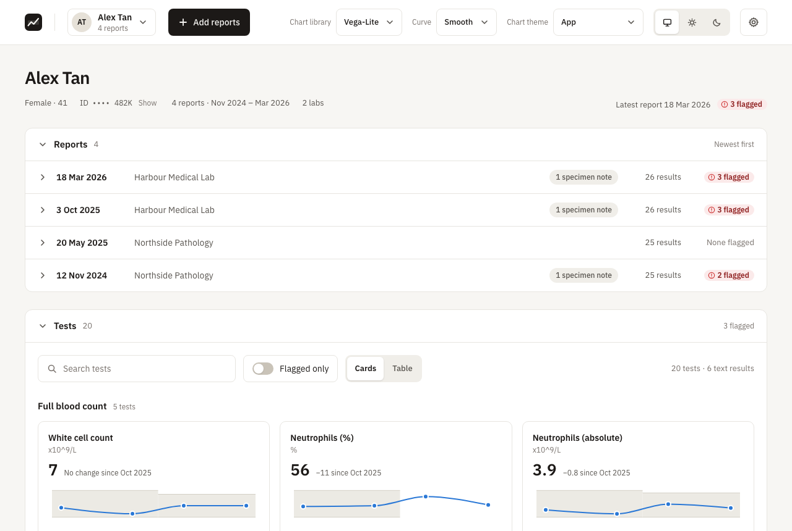
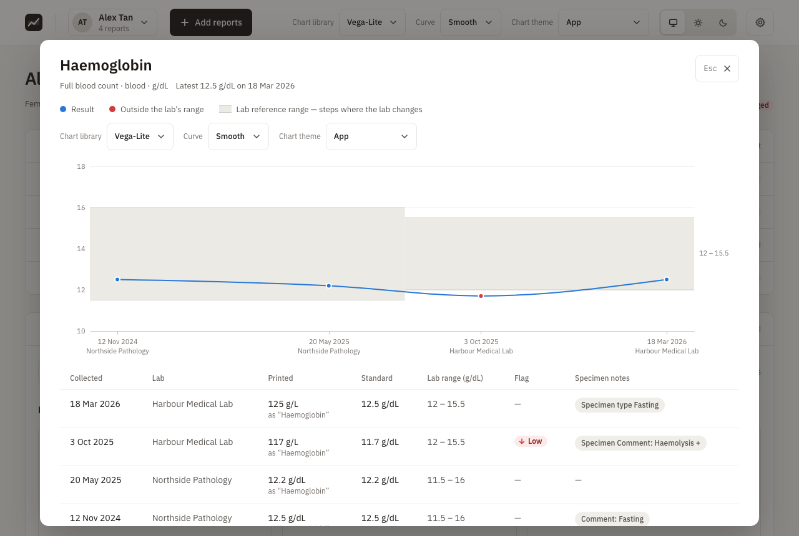
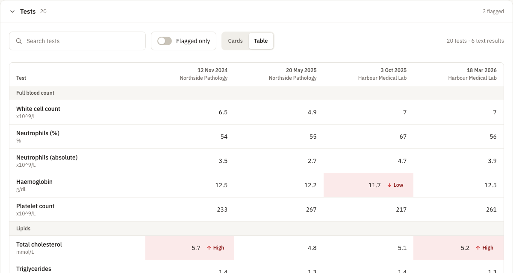
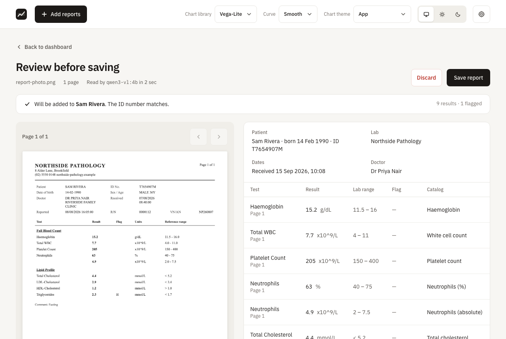
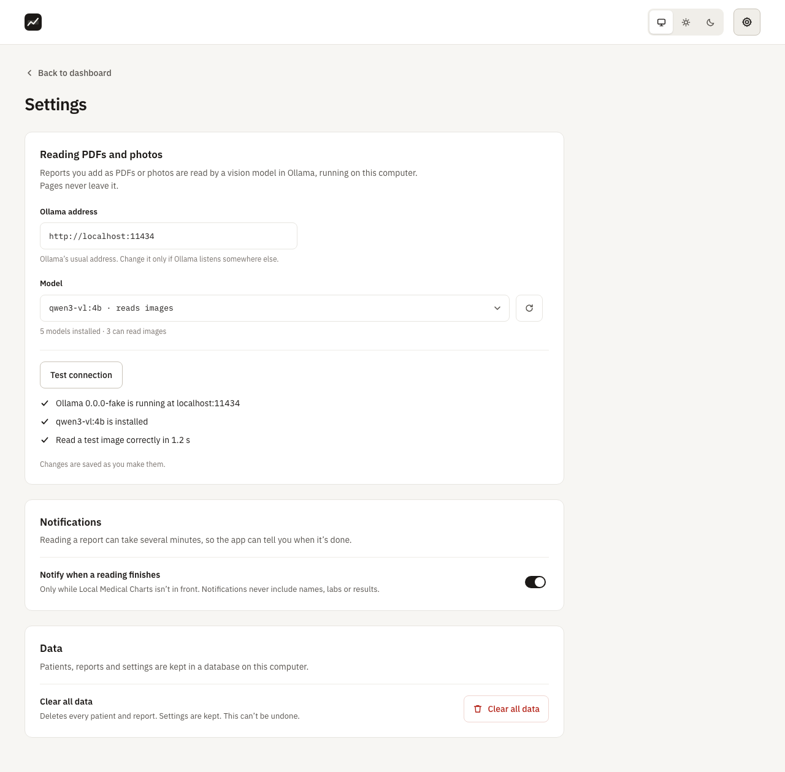

# Local Medical Charts

Chart lab results over time from printed and PDF lab reports. A vision model
running locally in Ollama reads each page, you check the reading, and every test
is charted across reports and labs. **Nothing leaves your computer.**



## Try it without Ollama

```sh
deno install
deno task dev
```

This opens the app in your browser with two fictional patients already loaded.
Adding a PDF or photo there pretends to read it, so you can also see the imports
panel and the review screen; a fictional report comes back after a few seconds.
Reports you add aren't kept, so reload to start again. Add `?empty` to the
address to start with no reports.

## What you need

- **[Deno](https://deno.com) 2.9.** It's the only thing to install: no Node.js,
  and never `npm install`, which would bypass the lockfile and pinned versions.
- **[Ollama](https://ollama.com) with a vision model**, only to read real PDFs
  and photos. The app uses `qwen3-vl:4b` unless you choose another
  (`ollama pull qwen3-vl:4b`). It needs about 5.5 GB of memory and runs on an
  Apple silicon Mac or a PC with a 12 GB graphics card. Larger models such as
  `qwen3.8:27b-mlx` (18–20 GB) read scans a little more accurately; see
  [the models tried](docs/ocr-models.md).

## Using it with your reports

```sh
deno install        # everything from deno.lock
deno task desktop   # build the app and open its desktop window
```

In the app, open **Settings** and press **Test connection** (choosing another
model first if you like), then add a report. Without Ollama, you can still add
the report JSON files in `samples/`.

| Task                           | What it does                                                                                                |
| ------------------------------ | ----------------------------------------------------------------------------------------------------------- |
| `deno task desktop`            | Build the app and open it in its desktop window (database in `.data/`)                                      |
| `deno task dev` / `build`      | Run the app in a browser on fictional data, or build it                                                     |
| `deno task test`               | Run the tests                                                                                               |
| `deno task extract <file.pdf>` | Split a report PDF into page images (`--embedded` for scanned PDFs)                                         |
| `deno task ocr`                | OCR page images in `.data/pipeline/images` into JSON in `.data/pipeline/readings` with a local Ollama model |
| `deno task map`                | Suggest catalog matches for test names the catalog doesn't know                                             |
| `deno task upgrade`            | Upgrade stored reports to the current schema version and catalog                                            |
| `deno task samples`            | Regenerate the fictional sample reports in `samples/`                                                       |
| `deno task classes`            | Check the app's Tailwind classes are in canonical form (`--write` fixes them)                               |

## Screenshots

A test's history, with each lab's reference range and every reading:



Every result in a table, a column per report, with flagged results marked:



A reading waiting to be checked before it's saved:



Choosing the local model and testing the connection:



All people, labs and results shown are fictional.

## Privacy

- Pages are read on your machine through Ollama. No cloud models, no API keys,
  no telemetry ([ADR 0001](docs/adr/0001-local-only-processing.md)).
- Uploaded PDFs and photos stay in memory until you save or discard the reading
  ([ADR 0012](docs/adr/0012-review-before-saving-imports-in-memory.md)).
- Every person, lab and result in this repo is fictional
  ([ADR 0013](docs/adr/0013-fictional-data-only.md)).

## Documentation

- [Product](docs/product.md): the problem, goals and non-goals.
- [Architecture](docs/architecture/overview.md): the parts and how data moves.
- [Decisions](docs/adr/): why it's built this way.
- [Features](docs/features/): each feature's spec, plan and tasks.
- [Development](docs/development.md): running, checks, versions and updating
  dependencies.
- [Vision models tried](docs/ocr-models.md).
