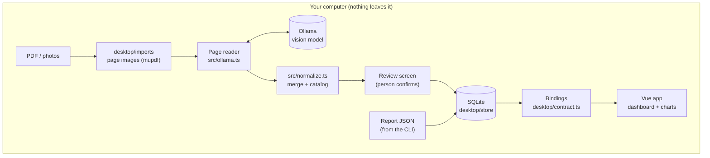
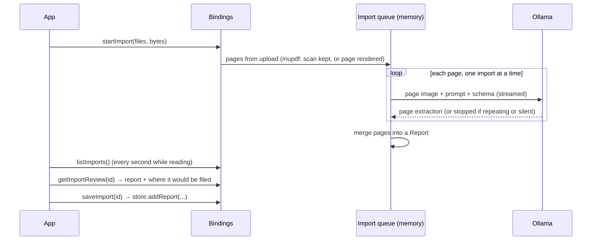
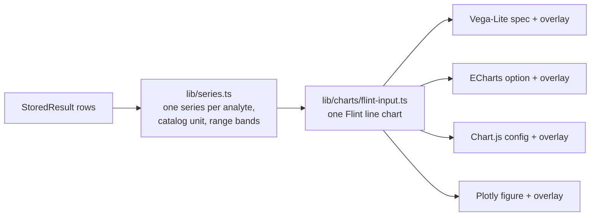

# Architecture overview

Local Medical Charts has three parts that share one data model:

1. **The pipeline** (`src/`): turns page images into validated, versioned report
   JSON. Usable on its own from the command line.
2. **The desktop side** (`desktop/`): a Deno Desktop process that owns the
   SQLite database, talks to Ollama, reads PDFs and photos, and exposes typed
   bindings to the window.
3. **The app** (`app/`): a Vue 3 single-page app rendered in the desktop
   window's webview. In development it runs in a normal browser against fake
   bindings.

## Data model

Two layers, both defined with Zod in `src/schema.ts`:

- **`PageExtraction`**: what the model returns for one page, deliberately close
  to what's printed. Values, units and reference ranges stay verbatim strings.
- **`Report`**: the merge of a report's pages, produced by code. Each result is
  parsed (number, comparator like `< 5`, or words), flagged, matched to an
  analyte in the catalog, and converted to the analyte's standard unit. The
  report also embeds its `pages`, so it can be re-merged later without the
  model.

Every page file and report carries `schemaVersion`
([ADR 0003](../adr/0003-versioned-reports-originals-kept.md)).

### The analyte catalog

`src/analytes.json` lists each analyte (e.g. haemoglobin), its dashboard group,
standard unit, the names labs print it under, and unit conversion factors.
Matching is an exact lookup on name, specimen and unit, never fuzzy
([ADR 0002](../adr/0002-model-transcribes-code-interprets.md)). Unknown names
stay "not in the catalog" until a person adds them; `deno task map` asks the
model for suggestions, which a person accepts. The catalog's hash is recorded in
every report, so a catalog change triggers a re-merge.

## The pipeline (`src/`)

| Module                           | Job                                                                                           |
| -------------------------------- | --------------------------------------------------------------------------------------------- |
| `pdf-to-images.ts`               | CLI: PDF pages to images (rendered, or the embedded scan with `--embedded`)                   |
| `ocr-prompt.md`, `ocr-prompt.ts` | The transcription prompt and its hash (recorded with every page)                              |
| `ollama.ts`                      | Structured chat with Ollama: schema as `format`, streamed, capped, retried on invalid replies |
| `ocr-reports.ts`                 | CLI: page images to page JSON and merged reports                                              |
| `normalize.ts`                   | Deterministic merge: parse values and ranges, derive flags, match the catalog, convert units  |
| `catalog.ts`, `analytes.json`    | The analyte catalog and lookup                                                                |
| `map-analytes.ts`                | CLI: suggest catalog entries for unknown names                                                |
| `migrations/`, `upgrade.ts`      | Bring stored JSON to the current format and catalog                                           |

## The desktop side (`desktop/`)

- **`main.ts`** opens the window, opens the database, upgrades stored reports,
  binds the handlers and serves the built app.
- **`contract.ts`** is the single `DesktopBindings` type, checked on both sides:
  `win.bind()` in Deno and `globalThis.bindings` in the page.
- **`bindings.ts`** implements it against the store, the Ollama service and the
  import queue. `unavailableBindings` explains a database that won't open.
- **`store/`**: `ReportStore` over `node:sqlite`. Tables `patients`, `reports`,
  `results` and `settings`; its own migrations in `PRAGMA user_version`.
- **`ocr/`**: listing Ollama models and the three-step connection test.
- **`imports/`**: reading PDFs and photos in the background, one at a time.

### Storage

| Table      | Holds                                                                                                  |
| ---------- | ------------------------------------------------------------------------------------------------------ |
| `patients` | One row per person, keyed by normalised ID number (or name and date of birth)                          |
| `reports`  | The upload **exactly as received**, the upgraded report, schema version, catalog hash, status          |
| `results`  | One row per result, rebuilt from the upgraded report, so charts query without parsing JSON             |
| `settings` | Theme, selected patient, chart library, curve and chart theme, Ollama address and model, notifications |

On launch, any report whose format or catalog is out of date is upgraded again
**from its original**. A report that fails is kept and marked failed, never
deleted. The database lives in the OS app-data folder
(`~/Library/Application Support/Local Medical Charts` on macOS), or `.data/` in
development.

### Reading PDFs and photos

- A PDF page that is one upright full-page scan is sent as the scanner's own
  image; any other page is rendered at 150 dpi. Photos are sent as they are, in
  the order the person confirms.
- Imports, page images and readings stay in memory until saved or discarded
  ([ADR 0012](../adr/0012-review-before-saving-imports-in-memory.md)).
- File bytes cross the binding as their own argument: nested inside an object, a
  `Uint8Array` doesn't survive.
- When an import becomes ready or fails while the window is behind, a system
  notification says so in generic words (no names or results), if the setting is
  on. Clicking it opens that import's review, or the imports panel after a
  failure ([feature 010](../features/010-reading-notifications/spec.md)).

## The app (`app/`)

Vue 3 `<script setup>` components, Tailwind 4, VueUse, built by Vite 8 running
under Deno ([ADR 0006](../adr/0006-vue-with-vite-under-deno.md)).

| Area               | Where                                                                                               |
| ------------------ | --------------------------------------------------------------------------------------------------- |
| Connecting         | `api/index.ts`: real bindings in the window, `api/fake-bindings.ts` in a browser                    |
| Shared state       | `composables/` (`useLibrary`, `useImports`, `useOcrSettings`, `useTheme`, `useRoute`, …)            |
| Pure logic, tested | `lib/` (dashboard, test grid, series, formatting, uploads, review, …), tests in `desktop/*_test.ts` |
| Charts             | `lib/charts/`: Flint input and themes, one spec builder and one lazy-loaded backend per library     |
| Screens            | `views/`: Welcome, Dashboard, Settings (`#/settings`), Review (`#/review/:id`)                      |

### Charts

Flint assembles the same line chart for every library; a small overlay per
library adds what Flint can't express yet (reference bands, hollow markers for
`< 5`-style results, shared axes). Each library loads only when chosen
([ADR 0010](../adr/0010-flint-chart-spec.md)).

A chart theme from Flint styles a chart only in the libraries Flint themes.
There, the overlay keeps Flint's styling and adds only the app's rules;
elsewhere the chart keeps the app's look (`lib/charts/themes.ts`,
[ADR 0016](../adr/0016-flint-chart-themes.md)).

## Testing

- `deno task test` runs every test in Deno: pipeline, store (in-memory SQLite),
  bindings, import queue, Ollama client against stand-in servers, and the app's
  pure logic and chart specs.
- **Contract suite** (`desktop/contract_suite.ts`): the same tests run against
  the real SQLite bindings and the browser fake, so the fake can't drift.
- **Browser checks:** `deno task dev` plus a headless browser for screens.
- All fixtures are fictional ([ADR 0013](../adr/0013-fictional-data-only.md)).
